# Aplikasi Kelola Kontak
## Dependencies

Link sumber untuk [JDBC Driver SQLite](https://github.com/xerial/sqlite-jdbc). 

## My Bio
Nama : Muhammad Junaidi  
NPM  : 2210010097  
Kelas: 5B TI REG BJB Pagi  

## Features Demo
### Aplikasi awal dibuka
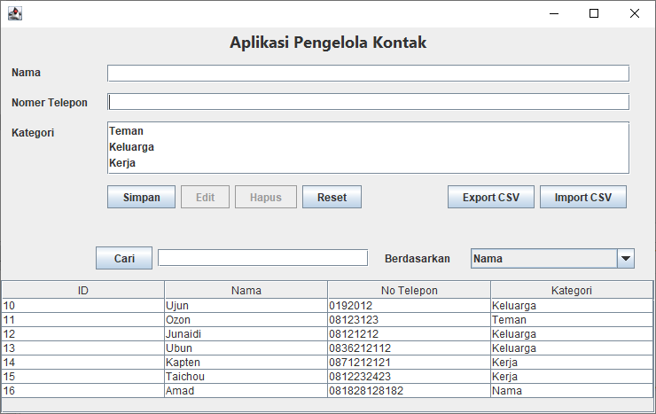

### Simpan Data Kontak
1. Simpan Sukses
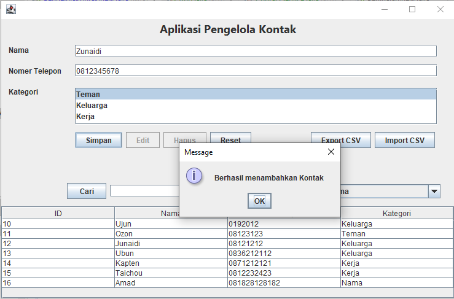

2. Simpan gagal, data nama kosong
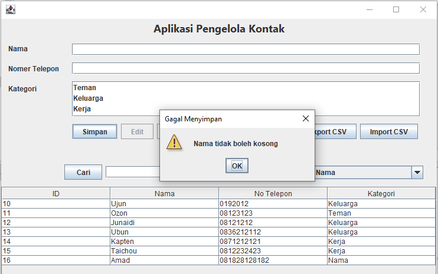

3. Simpan gagal, data telepon kosong
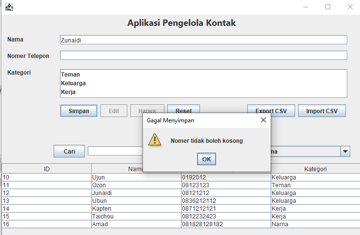

4. Simpan gagal, nomer telepon terlalu pendek
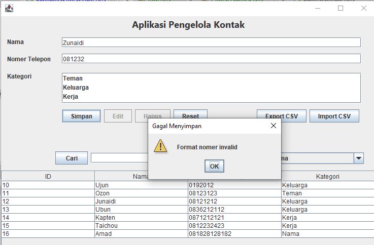

5. Simpan gagal, nomer telepon terlalu panjang
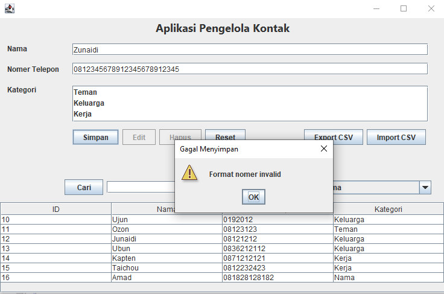

6. Simpan gagal, kategori belum dipilih
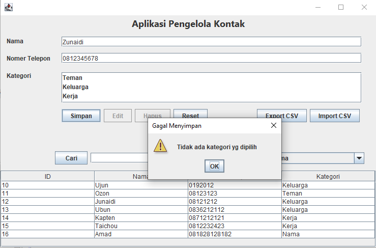

### Baris data kontak pada table diklik
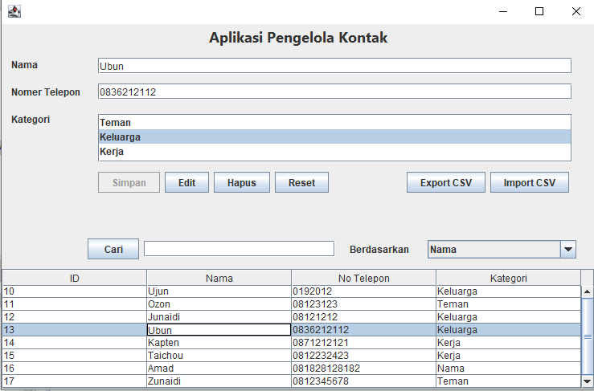

### Edit Data Kontak
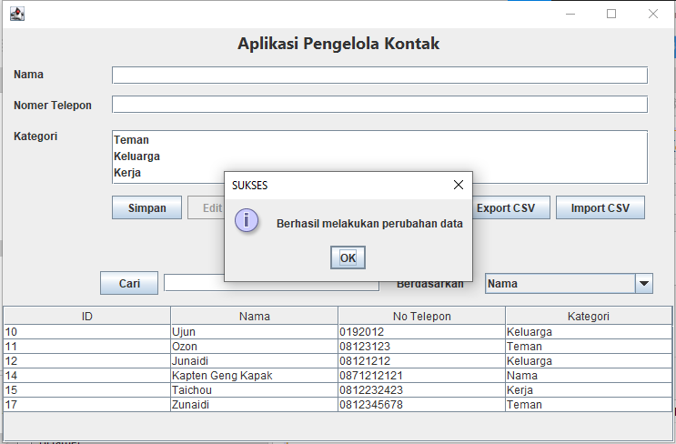

### Hapus Data Kontak
1. Konfirmasi apakah data kontak yakin untuk dihapus
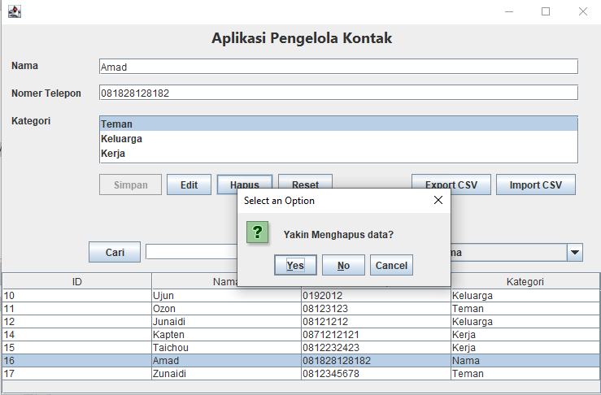

2. Hapus data kontak dikonfirmasi
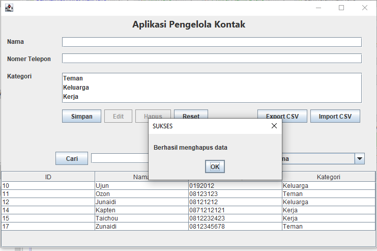

### Pencarian Kontak
1. Cari berdasarkan nama
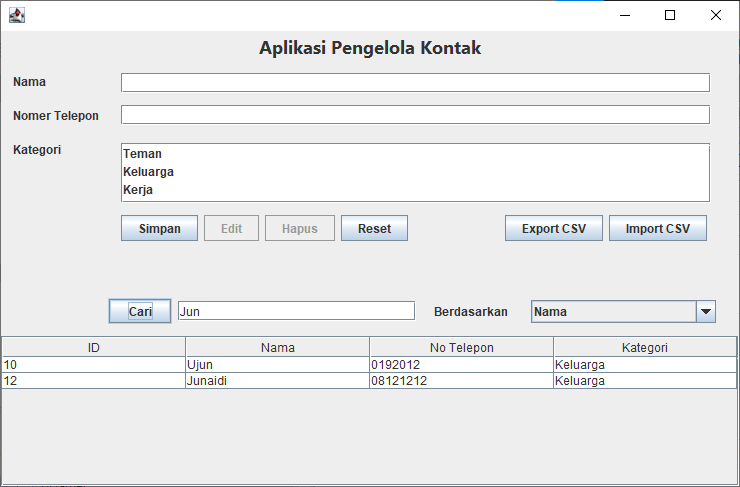

2. Cari berdasarkan nomer telepon
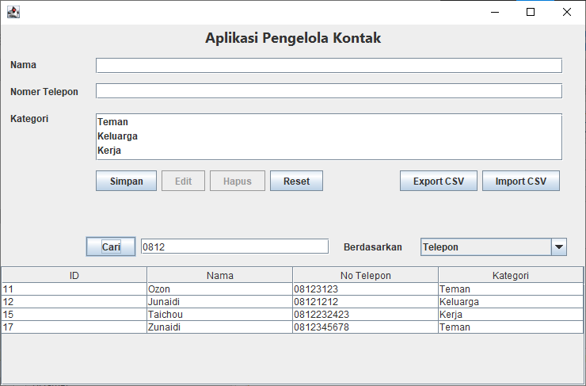

### Export ke CSV
1. Klik tombol Export, masukkan nama file dan pilih lokasi menyimpan file csv
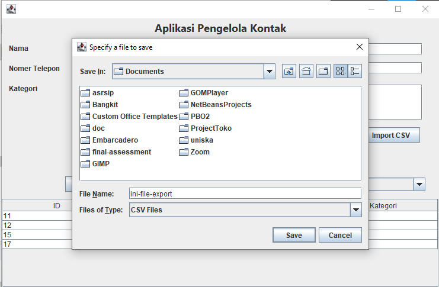

2. Klik Save, maka akan file telah ter-export
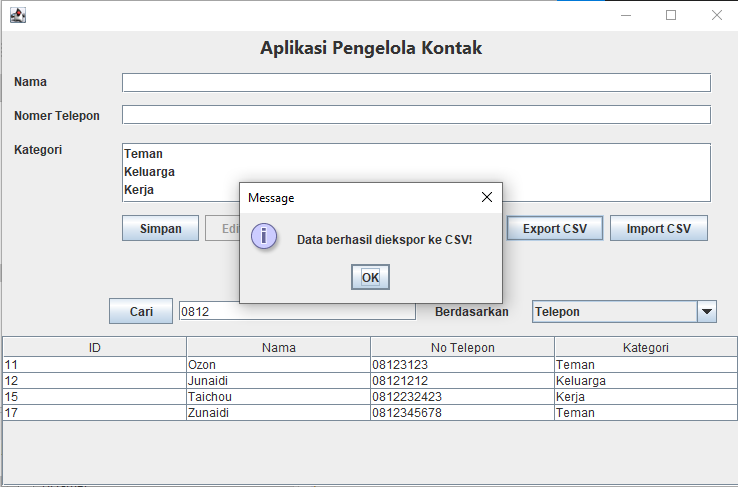

3. Periksa file csv yang telah kita export
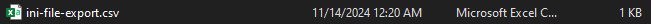

### Import data dari file CSV
1. Klik tombol Import, dan pilih file target
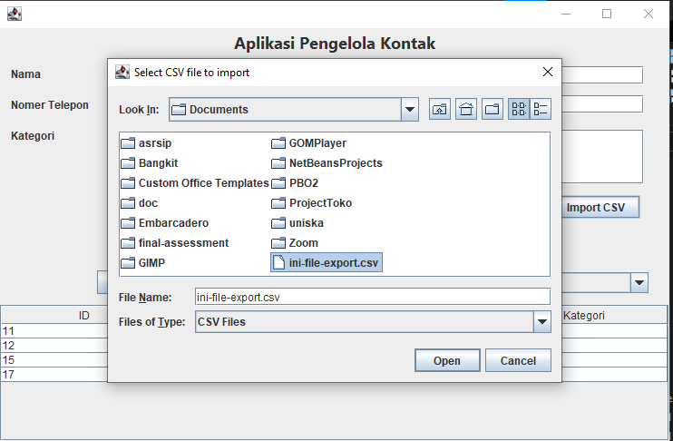

2. Klik open, maka file telah ter-import ke dalam database
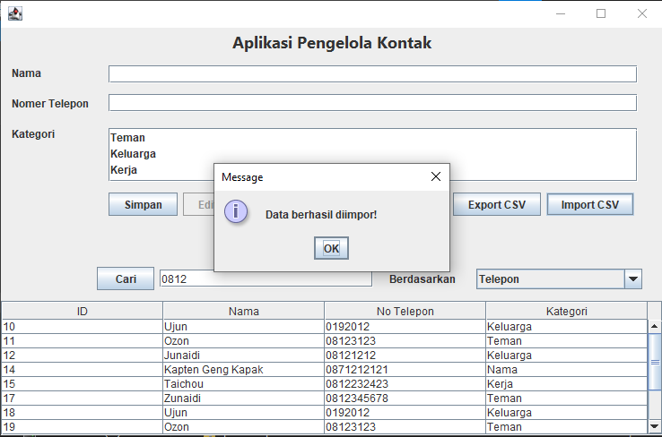